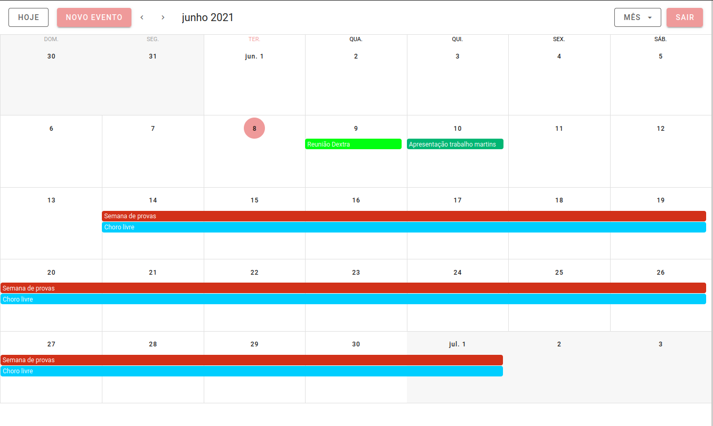
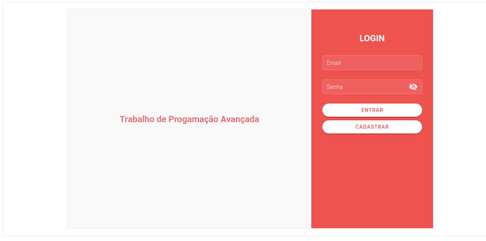
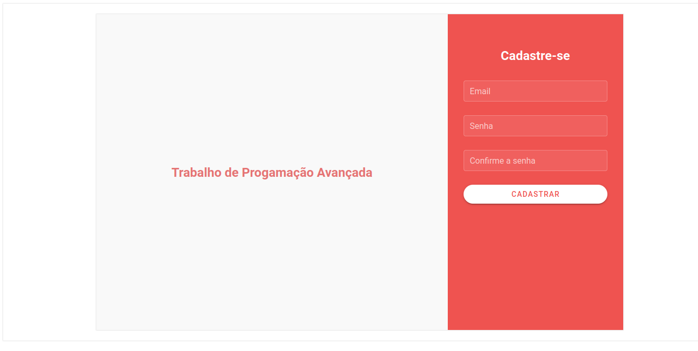
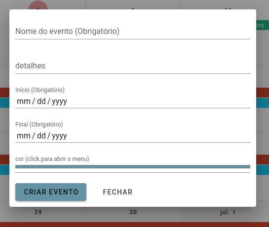
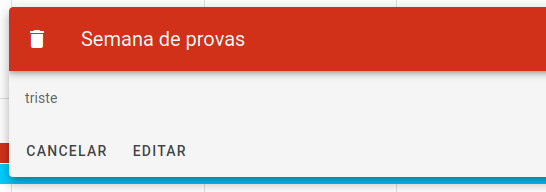

<meta charset="utf-8">
  <h1 align="center">
    
  <h1 align="center">📟 Agenda 📅</>
  </h1>
<p align="center">
  
  
  
  <a href="https://github.com/dibressonCosta/prog_avancada/">
    
  </a>
</p>

## Sobre a Agenda
<p align="center">
  
  
  
  
  
</p>

Agenda com sistema de login.
Cada usuário possui seus eventos exclusivos, é necessário autenficação para acessar o calendário com eventos. Para a autentificação foi criado um "token" que é composto de uma soma de valores de uma forma que cada acesso esse "token" seja diferente.

## Layout das Telas

<p align="center">
  
</p>
<p align="center">
  
  
</p>
<p align="center">
  
  
</p>

# Backend da Agenda

## Instalação e uso

##### - 📟 API

```sh
  $ cd back
  # Instalar as dependencias
  $ pip3 install -r requirements.txt
  # Iniciar a API
  $ flask run
```

##### - 🪐 Front

```sh
  $ cd agenda
  # Instalar as dependencias
  $ npm install
  # Iniciar Web
  $ npm run serve
```
<br>

Acesse: [`http://localhost:8080/`](http://localhost:8080/) para visualizar.
<br>
